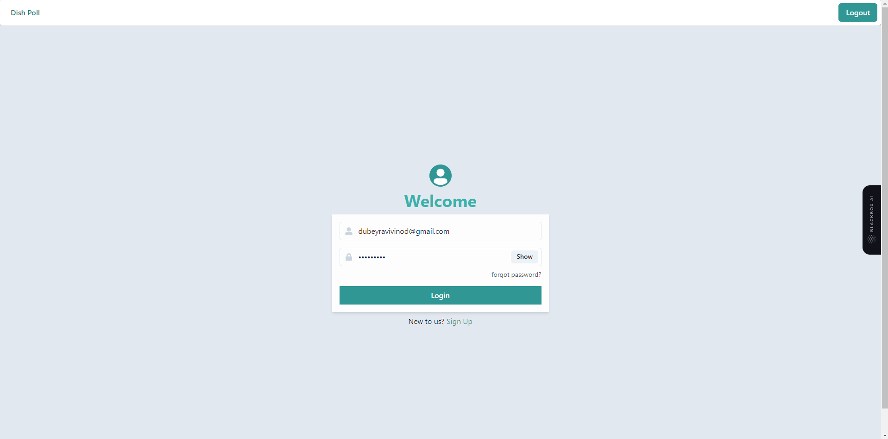
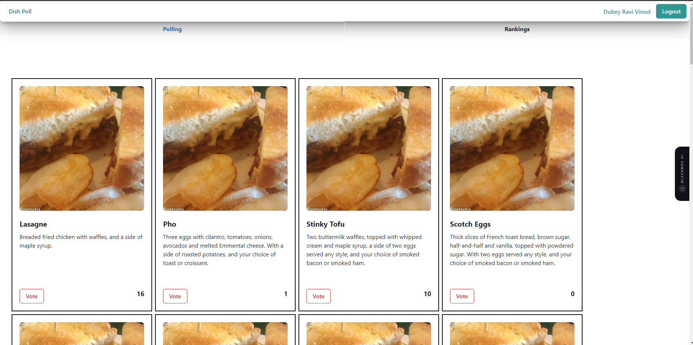
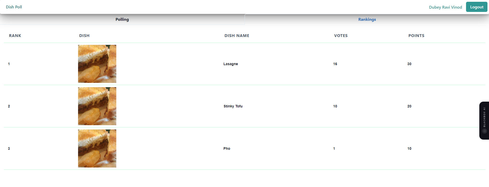

# Dish Ranking

## Description:

Make a small react app for ranking dishes. Multiple users should be able
to login into the app and vote for their favorite dishes and see the
results of the poll.

## Screen and Functionalities:

### Login Screen:

A user should be able to login into the app using a
username and password. Since there is no backend to query you can use
a static list of users. Refer to users.json for the static list of users to use
Once logged in the main app should have 2 tabs (or equivalent).

### TAB 1:

Fetch the list of dishes using an API and display the results for the
user to vote. Each user then should be able to make a selection of 3
dishes from the poll that has been created. Each selection is given points
based on the rank (Rank 1 gets 30 points, Rank 2 gets 20, Rank 3 gets
10). Save the user’s selections for displaying it to him on the next screen
for poll results. A user should be able to edit his choices anytime even
after submission i.e. if Dish 1 was Rank 1, the user can change it to no
Rank or Rank 2, if there is another dish with the same rank the other
dish will lose its rank

### URL to fetch dishes:
`API: [https://raw.githubusercontent.com/syook/reactdishpoll/main/db.json](https://raw.githubusercontent.com/syook/reactdishpoll/main/db.json)`

Sample dish object
```json
{
"id": 1,
"dishName": "Lasagne",
"description": "Breaded fried chicken with waffles, and a side of maple syrup.",
"image": "https://loremflickr.com/300/300/food"
}
```
### TAB 2:

Show the dishes in the descending order of the points received
from the polling. The logged in user should also be able to see his
selections in this list so that he knows where his selected dishes stand in
the rankings.


# Live Example: 

### Link:  [Dish Ranking App](https://dishes-ranking.vercel.app/)

## user.json -> demo user (static user)
``` json
[
    {
        "id": 1,
        "username": "Dubey Ravi Vinod",
        "email": "dubeyravivinod@gmail.com",
        "password": "dubey@123"
    },
    {
        "id": 2,
        "username": "Ramesh Chaudhary",
        "email": "romanchaudhary@gmail.com",
        "password": "ramesh@123"
    },
    {
        "id": 3,
        "username": "Radha Kishan",
        "email": "kishan1@gmail.com",
        "password": "kishan1@gmail.com"
    },
    {
        "id": 4,
        "username": "Sanjeeth Singh",
        "email": "sanjeethsingh@gmail.com",
        "password": "123456789"
    },
    {
        "id": 5,
        "username": "Ashish Kumar",
        "email": "avd@gmail.com",
        "password": "ad1999@outlook.com"
    }
]
```

# Screenshot
## Login Page
<figure>

<figure-caption>Figure 1. Login Page.</figure-caption>
</figure>

## Polling Page
<figure>

<figure-caption>Figure 2. Polling/Vote to your delicious food.</figure-caption>
</figure>


## Ranking Page
<figure>

<figure-caption>Figure 3. Ranking page will organize data in descending order.</figure-caption>
</figure>
